**The first comprehensive, validated measure of prescriptive regulatory burden across the UK statute book. Where QuantGov RegData counts restriction words, UKRegBurden counts the burdens themselves — distinct legal obligations and prohibitions, classified by who bears them and in what capacity.**

This repository contains the corpus-building and candidate-extraction pipeline and the methodology documents for a project that measures the stock and flow of legally binding obligations and prohibitions across the entire body of UK law in force. Results are forthcoming in a separate think-tank publication.

---

## Status

| Phase | State |
| --- | --- |
| Corpus build | **Complete — 69,885 fully digitised pieces of in-force UK legislation**, i.e. 100 % of the items that legislation.gov.uk exposes with substantive machine-readable CLML. This is the extraction input. |
| Methodology | **v14** — six-category classification + polarity; validation rubric **v1.0 (signed off, published)**, stress-tested across 60 real sections spanning five drafting eras; independent dual-LLM labelling pilot with human adjudication next |
| Pipeline | **Layers 0–1 built and verified** (corpus, sectioning, high-recall candidate extraction); Layers 2–5 designed. **Labelling phase next:** dual independent LLM labelling (Claude + Gemini) against the rubric → human adjudication → a fine-tuned Legal-BERT classifier at corpus scale |
| Results | **Forthcoming** in a separate think-tank paper |

> **Provisional figures.** Coverage findings have been shared with The National Archives for confirmation of our reading of their data; the figures below are provisional pending their response. Validation has two legs: The National Archives relates to **corpus validity only** (that we have read the in-force universe correctly); the regulatory-burden results are validated separately against a line-by-line manual workbook.

The headline corpus figure — **69,885 pieces of fully digitised in-force UK legislation** — sits inside a wider universe of 119,841 in-force items catalogued by The National Archives. A single coverage ratio across that universe conflates two structurally different populations, so coverage is reported at three nested scopes:

| Scope | Description | In-force universe | In corpus | Coverage |
|---|---|---:|---:|---:|
| **A — Full universe** | Every in-force item across all 28 leg_types | 119,841 | 69,885 | **58.3 %** |
| **B — General application** | Excludes local & private Acts (ukla, ukppa, gbppa, eppa, gbla, uklp) | 89,548 | 69,695 | **77.8 %** |
| **C — Post-1990 general application** | Scope B and year ≥ 1990 (modern regulatory law) | 67,403 | 61,745 | **91.6 %** |

The 91.6 % post-1990 figure is the most directly relevant denominator for contemporary regulatory-burden analysis; the 58.3 % full-universe figure is reported for completeness. The 49,956-item residual is structural, not a retrieval failure: ~31,407 items are digitised only as metadata-only / PDF-only shells with no machine-readable body, and ~18,505 return HTTP 404 on every retrieval channel and are not digitised at all. An exhaustion sweep across all per-item API channels plus a full cross-reference against the legislation.gov.uk Best Collection bulk download confirmed that no further substantive content is recoverable. See [`docs/coverage_methodology_note.md`](docs/coverage_methodology_note.md) and [`docs/coverage_table.csv`](docs/coverage_table.csv) for the per-type breakdown.

The corpus **manifest** (`corpus_manifest.csv`, 212,227 rows) lists catalogued items by their `legislation.gov.uk` URL, title, year, and type — distinct from the **69,885-item in-force analyser corpus** (the fully-digitised subset the pipeline actually reads). The underlying XML text is not redistributed here; it is sourced from [legislation.gov.uk](https://www.legislation.gov.uk) under the [Open Government Licence v3.0](https://www.nationalarchives.gov.uk/doc/open-government-licence/version/3/).

---

## Why this matters

No government, regulator, or researcher currently has a reliable answer to the question: how much regulation exists in the UK, and is it growing or shrinking? This project sets out to provide that answer.

Existing UK regulatory-burden estimates count pages, words, or statutory instruments — proxies that conflate prescriptive content with definitional text, repealed provisions, and devolved-government plumbing. This project counts **legally binding obligations and prohibitions on private actors**: the specific provisions that impose compliance cost on businesses, individuals, and the third sector.

**What is counted (summary).** A *regulatory burden* is an obligation or prohibition, with legal force, imposed on a private actor. Each is classified into a **six-category taxonomy** (numeric IDs 1–6 canonical; see [`category_mapping.md`](category_mapping.md)): direct burden; conditional burden (operational); implied burden; implied burden active; conditional burden (regulator-triggered); and ambiguous — plus a polarity (obligation / prohibition) on every burden. Public-body obligations are excluded by definition.

**Headline counting principles.** The measure is a *curated count*, not a term-frequency proxy: **count at source** (each burden once, at the provision that imposes it — not where it is referenced, penalised, or amended); a **unit rule** distinguishing distinct burdens from conditions/particulars of one burden; **amendment provenance** (textual amendments are machinery, counted at the consolidated target); **frontier proxies** (a statutory duty to comply with an out-of-measure instrument — a permit, byelaw, or regulator rulebook — is counted once as a proxy for that invisible layer); and **typed exclusions** (non-operative candidates are recorded, not silently dropped). Scope, capacity, and the layer boundary are fixed in [`project_objective_anchor.md`](project_objective_anchor.md).

The full validation rubric — the burden definition, the six categories + polarity, and the decision rules the labelling pilot classifies against — is published at [`docs/validation_rubric.md`](docs/validation_rubric.md) (v1.0, authoritative following the project lead's sign-off read).

Full methodology: [`docs/methodology.md`](docs/methodology.md). Research agenda: [`docs/research_agenda.md`](docs/research_agenda.md). Implementation plan and stage-2 design: [`docs/implementation_plan.md`](docs/implementation_plan.md), [`docs/decision_tree_gaps.md`](docs/decision_tree_gaps.md).

---

## Architecture

The classifier was reframed (2026-06-14) from a rule-based analyser to a layered pipeline: high-recall extraction → dual-model labelling → a trained production classifier. The rule-based analyser is **retired as a classifier**; only its extraction/candidate-filtering lineage survives, rebuilt as `extract_candidates.py`.



*Diagram sources (Mermaid): [`docs/pipeline_architecture.mmd`](docs/pipeline_architecture.mmd) (systems view) and [`docs/candidate_decision_tree.mmd`](docs/candidate_decision_tree.mmd) (logic view).*

- **Layer 0 — Corpus & metadata.** `legislation.db` (in-force items tagged `na_inforce=1`); Status filtering strips Prospective/Repealed/Dead/Discarded provisions; three-tier digitisation coverage.
- **Layer 1 — Sectioning & extraction (built).** `extract_candidates.py` anchors each provision by DOM identity (a three-tier anchor over eight `material_type`s), assembles chapeau + leaves with no truncation, and flags a section for review if any high-recall cue fires anywhere in its subtree. One record per flagged section; no label assigned here.
- **Layers 2–4 — Structural rules, decomposition, attribution (designed).** Count-at-source, the unit rule, non-operative exclusions, the six categories + polarity, obligated-party and capacity attribution.
- **Layer 5 — Labelling & adjudication (next).** Claude and Gemini classify each section independently against the rubric; disagreements route to human adjudication; the validated labels train **Legal-BERT**, the production classifier that runs the full corpus.

---

## Repository contents

| Path | Purpose |
| --- | --- |
| `extract_candidates.py` | **High-recall candidate-extraction pipeline** (Layer 1): DOM-keyed section anchoring, assembly, Stage-1 recall gate |
| `downloader.py` | Per-item XML download, CLML parsing, Status filtering, schedule classification |
| `bulk_loader.py` | Bulk-download orchestration over the legislation.gov.uk Bulk archive |
| `missing_si_downloader.py` | Targeted re-downloads to fill statutory-instrument coverage gaps |
| `analyser.py` | *Retired prior art* — the former rule-based sentence classifier, superseded by `extract_candidates.py` + the LLM/Legal-BERT labelling layer |
| `word_list.py` | *Retired-as-classifier* — the cue vocabulary, now serving `extract_candidates.py`'s high-recall filter |
| `test_run.py` | End-to-end harness for the retired analyser (kept for reference) |
| `corpus_manifest.csv` | Full manifest of catalogued items (URL, title, year, type; 212,227 rows) |
| `category_mapping.md` | Canonical numeric category IDs ↔ presentational names |
| `project_objective_anchor.md` | The project anchor — objective + scope (what is counted, and the in/out-of-measure layer boundary) |
| `docs/methodology.md` | Full methodology specification (v14) |
| `docs/validation_rubric.md` | **The validation rubric (v1.0)** — burden definition, six categories + polarity, and the decision rules the labelling pilot classifies against |
| `docs/coverage_methodology_note.md` | Coverage methodology: definitional rule, exhaustion sweep, structural-gap analysis, out-of-measure scope disclosure |
| `docs/coverage_table.csv` | Per-type coverage table (in-force universe / in corpus / coverage %) |
| `docs/implementation_plan.md` | Implementation plan, pipeline layers, schema notes, corpus state (v15) |
| `docs/decision_tree_gaps.md` | Stage-2 design agenda — the per-node gap list |
| `docs/pipeline_architecture.mmd`, `docs/candidate_decision_tree.mmd` | Architecture diagrams (Mermaid source) |
| `docs/research_agenda.md` | Open questions and future phases |
| `rubric_revision_notes.md` | Running log of rubric revisions pending the next authoritative pass |
| `project_decision_log.docx` | Decision & correction log (design decisions with reasoning) |
| `tna_dataset_comparison.md`, `tna_crosscheck_methodology.md` | Comparison with, and validation layer derived from, TNA's Statutory Powers and Duties dataset |
| `LICENSE` | MIT licence covering the source code |
| `LICENSE-docs` | CC-BY-4.0 covering methodology documents and the corpus manifest |

The **validation rubric (v1.0)** is published as [`docs/validation_rubric.md`](docs/validation_rubric.md) — authoritative following the project lead's sign-off read (2026-07-17). The editable master document is maintained separately and not redistributed; the published markdown is the canonical public copy.

---

## How to replicate

### 1. Build the corpus

```bash
# Download the legislation.gov.uk Bulk archive separately
# (https://www.legislation.gov.uk/bulkdata) and place at ./Bulk download/

python bulk_loader.py            # Loads bulk XML into legislation.db
python missing_si_downloader.py  # Fills SI gaps via per-item API
```

Expected runtime: several days of wall time at the legislation.gov.uk rate limit (≈3 requests/second). The bulk-load step is single-shot; the gap-fill step is resumable.

### 2. Extract candidates

```bash
python extract_candidates.py     # Section-anchored, high-recall candidate extraction
```

Produces `candidates.jsonl` (one record per flagged section, with assembled text, `leaves[]`, `material_type`, and non-blocking hints) plus a flat index. This is Layer 1; no category or polarity label is assigned here — labelling is the next phase (dual-LLM + human → Legal-BERT).

### Dependencies

```bash
python -m pip install requests beautifulsoup4 lxml nltk
```

Python 3.10+. SQLite 3.35+ for `legislation.db`.

---

## Data provenance and licensing

- **Source corpus:** [legislation.gov.uk](https://www.legislation.gov.uk), maintained by The National Archives, available under the [Open Government Licence v3.0](https://www.nationalarchives.gov.uk/doc/open-government-licence/version/3/).
- **Corpus manifest (`corpus_manifest.csv`):** derived dataset, CC-BY-4.0. Cite as: Elsden, J. (2026). *UK Regulatory Burden Measurement — corpus manifest.*
- **Methodology documents (`docs/*.md`):** CC-BY-4.0.
- **Source code:** MIT.

`legislation.db` (full provision text) is not redistributed here — it is reconstructed deterministically from the pipeline above. The extraction pipeline operates on the 69,885-item fully-digitised in-force subset (`na_inforce = 1 AND length(full_text) >= 200`). The remaining 49,956 items in the National Archives in-force universe are ~31,407 metadata-only / PDF-only shells and ~18,505 records not digitised on legislation.gov.uk; see [`docs/coverage_methodology_note.md`](docs/coverage_methodology_note.md) for the full characterisation.

---

## Citation

If you use this code, methodology, or corpus manifest, please cite:

> Elsden, J. (2026). *UK Regulatory Burden Measurement: methodology, corpus, and pipeline.* https://github.com/jelsden92/uk-regulatory-burden

A formal working-paper citation will be added when the results paper is published.

---

## Contact

Jethro Elsden — jelsden1000@gmail.com
